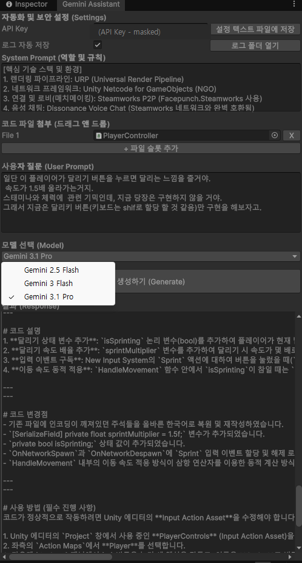
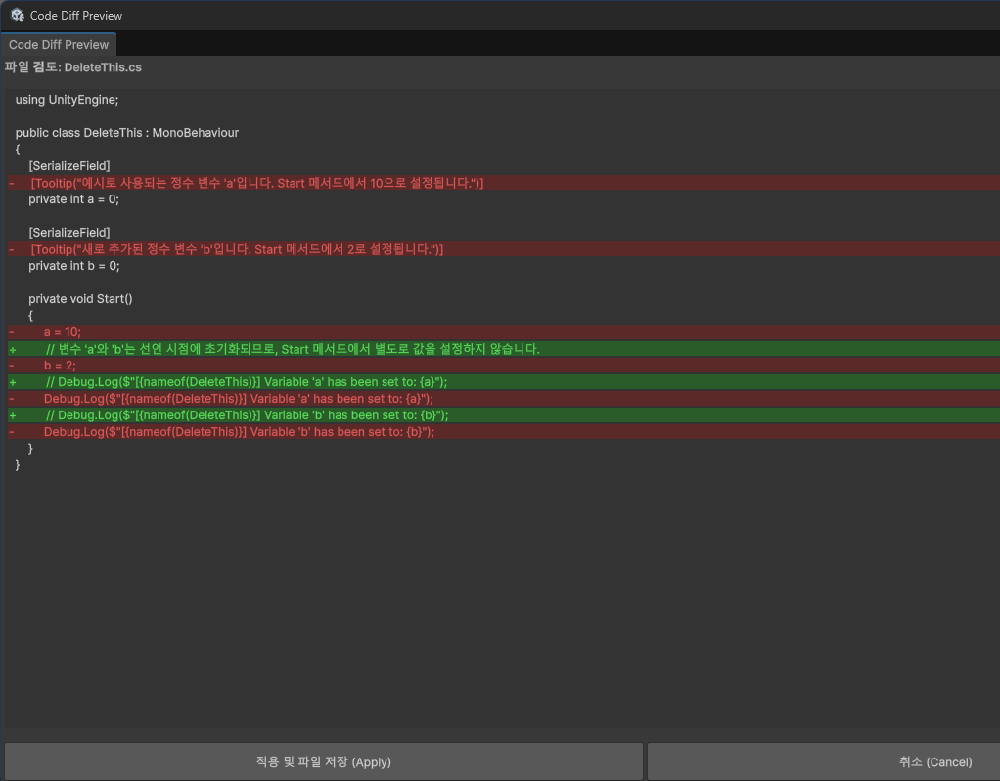

# Unity Gemini Assistant (UGA / GAD)

Unity 에디터 안에서 동작하는 생성형 AI 어시스턴트 툴입니다.
2026년 3~4월, MCP나 Claude Code 같은 도구의 존재를 모르던 시기에 — 웹과 에디터를 오가는 복사·붙여넣기가 답답해서 직접 만들었습니다.

> **현재는 사용하지 않습니다.** 이후 Claude Code·MCP 등 기성 도구에서 같은 구조를 확인하고 전환했으며, 이 리포는 그 과정의 기록으로 보존합니다. (포트폴리오 열람용)

| 코드 어시스턴트 (UGA) | diff 승인 창 |
|---|---|
|  |  |

*왼쪽: 2026년 3월 실사용 화면(초기 API Key 버전, 키는 마스킹). 오른쪽: 적용 전 변경점을 사람이 검토하는 diff 창.*

## 구성

| 파일 | 역할 |
|---|---|
| `GeminiAssistantWindow.cs` | 코드 어시스턴트 본체 — 파일 첨부(파일별 수정 허용 토글) → 생성 → 태그 프로토콜 파싱·새니타이저 → diff 승인 → 적용 → **컴파일 검증 → 에러를 다시 보내 자동 재수정(최대 2회)** |
| `GeminiDiffWindow.cs` | 적용 전 줄 단위 diff 검토 창 (승인/취소) |
| `GeminiAssistantDesignWindow.cs` (GAD) | AI의 명령을 리플렉션으로 씬에 적용 — 오브젝트 생성, 컴포넌트 추가, 필드/참조 할당, 부모·태그·레이어·머티리얼 변경 등. **전 작업을 Undo에 등록**해 되돌리기 가능 |
| `GeminiAssistant.asmdef` | 에디터 전용 어셈블리 정의 |

## 설계 포인트

- **AI 출력을 그대로 믿지 않는다** — 당시(2026년 초) 모델은 지금보다 불안정해서, 태그 프로토콜(`[FILE_START]`/`[FILE_END]`), 마크다운 새니타이저(C# 전처리기 지시문은 보존), 컴파일 게이트, 자동 재시도 같은 방어 장치가 필요했습니다.
- **사람이 승인한다** — 모든 코드 변경은 diff 창을 거치고, 파일마다 수정 허용 여부를 사용자가 지정합니다.
- **되돌릴 수 있다** — 씬 조작(GAD)은 전부 Unity Undo 시스템에 등록됩니다.
- 인증은 초기 API Key 방식에서 GCP 서비스 계정(OAuth 2.0, JWT RS256 직접 서명)으로 개선했습니다. Unity의 .NET 제약 때문에 PKCS#8 개인키 DER 파싱을 코드로 직접 처리합니다.

## 저작에 대해

구현 코드는 AI(Gemini)가 작성했습니다. 기능을 하나씩 정의하고, 사용하며 실패 양식을 관찰해 보완을 지시하고, 검증 구조(diff 승인·컴파일 게이트)를 설계한 것이 제 몫입니다 — **AI와 함께 AI 도구를 만든 기록**입니다.

## 사용 시 주의

- 실행에는 GCP 서비스 계정 JSON이 필요합니다. **키는 리포에 포함되어 있지 않으며**, 로컬 설정 파일에 경로만 저장됩니다.
- `BypassCertificate`로 TLS 인증서 검증을 우회합니다 — 로컬 개발 도구라서 감수한 트레이드오프이며, 프로덕션에는 부적합합니다.
- Unity 6 (URP 프로젝트에서 사용), 에디터 전용입니다. 주석과 UI는 한국어입니다.
